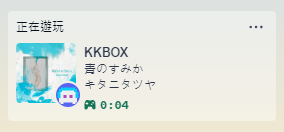
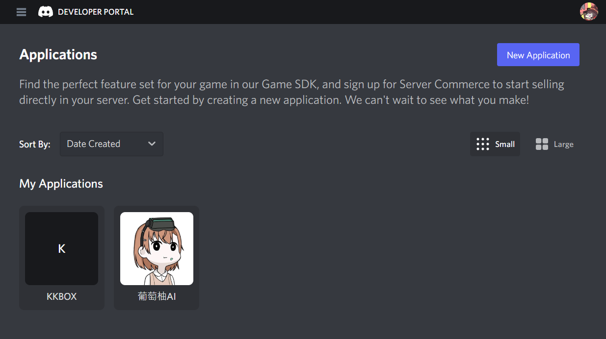
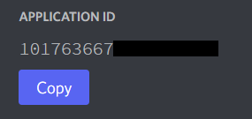

<div align="center">
<h1>🎵 KKBOX Discord RPC 🎶</h1>


<p>✨ This is a tool that allows Discord to display rich KKBOX statuses! ✨</p>


<br>

**English** | [繁體中文](README_zh-tw.md)

</div>

---

## 📥 Installation Guide

1️⃣ Download the latest version of [KKBOX Discord RPC](https://github.com/poyu39/KKBOX_Discord_RPC/blob/main/releases/KKBOX_Discord_RPC_v4.0.0.zip) and extract it into the KKBOX installation directory.

📂 **Typical installation path**:
```
C:\Users\YourUsername\AppData\Local\Programs\@universalelectron-shell
```

2️⃣ Follow the **Configuration Guide** below to set up the Discord Application ID, and you're ready to go! 🚀🎧

---

## ⚙️ Configuration Guide

#### 1️⃣ Go to the [Discord Developer Portal](https://discord.com/developers/applications) 🌐
<div align="center">
    
</div>

#### 2️⃣ Click **New Application** to create a new app 🆕
<div align="center">
    
</div>

#### 3️⃣ Go to the **General Information** page and copy the **APPLICATION ID** 🔑
<div align="center">
    
</div>

#### 4️⃣ Configure `config.json` ⚙️
After extraction, the folder should contain a `storage` directory. Open `config.json` inside.

🔧 Change `applicationId` to the copied APPLICATION ID.

🔧 Set `kkbox_exe_path` to the path of KKBOX.exe.

```json
{
    "kkbox_exe_path": "C:\\Users\\username\\AppData\\Local\\Programs\\@universalelectron-shell\\KKBOX.exe",
    "application_id": "1017000000000000000"
}
```

#### 5️⃣ Launch KKBOX Discord RPC 🚀

📌 To display KKBOX status on Discord, first run `KKBOX_Discord_RPC_v4.0.0.exe`. It will automatically launch KKBOX.

📌 `KKBOX_Discord_RPC_v4.0.0.exe` runs in the background to capture the currently playing content. If you don't want this feature, you can launch KKBOX manually via `KKBOX.exe`.

---