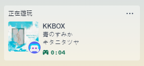

<div align="center">
<h1> KKBOX Discord RPC</h1>


<p>✨ 這是一個可以讓 Discord 顯示 KKBOX 豐富狀態的小工具！ ✨</p>



<br>

[English](README.md) | **繁體中文**

</div>

---

## 📥 安裝教學

1️⃣ 下載最新版本的 [KKBOX Discord RPC]()，然後解壓縮到 KKBOX 的安裝目錄。

📂 **通常安裝位置**：
```
C:\Users\使用者名稱\AppData\Local\Programs\@universalelectron-shell
```

2️⃣ 按照 **設定教學**，設定好 Discord 的 Application ID，即可開始使用！🚀🎧

---

## ⚙️ 設定教學

#### 1️⃣ 前往 [Discord Developer Portal](https://discord.com/developers/applications) 🌐
<div align="center">
    
</div>

#### 2️⃣ 點選 **New Application** 創建一個新的應用程式 🆕
<div align="center">
    
</div>

#### 3️⃣ 前往 **General Information** 頁面，複製 **APPLICATION ID** 🔑
<div align="center">
    
</div>

#### 4️⃣ 設定 `config.json` ⚙️
解壓縮後資料夾中會出現 `storage` 的資料夾，打開其中的 `config.json`。

🔧 修改 `applicationId` 為剛剛複製的 APPLICATION ID。

🔧 設定 `kkbox_exe_path` 為 KKBOX.exe 的路徑。

```json
{
    "kkbox_exe_path": "C:\\Users\\username\\AppData\\Local\\Programs\\@universalelectron-shell\\KKBOX.exe",
    "application_id": "1017000000000000000"
}
```

#### 5️⃣ 啟動 KKBOX Discord RPC 🚀

📌 要顯示 KKBOX 的狀態於 Discord，請先執行 `KKBOX_Discord_RPC_v4.0.0.exe`，會自動開啟 KKBOX。

📌 `KKBOX_Discord_RPC_v4.0.0.exe` 會在背景擷取播放內容，若不想使用此功能，可直接開啟官方 `KKBOX.exe`。

---